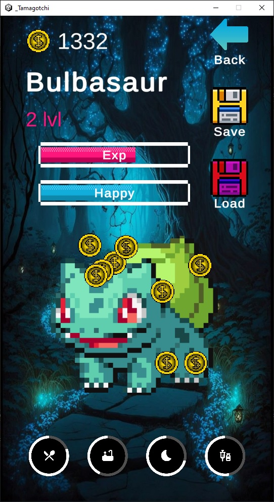
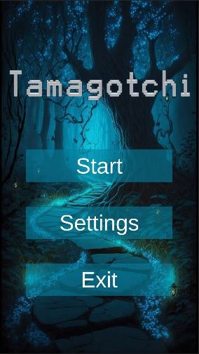
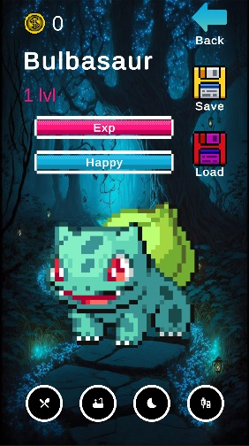
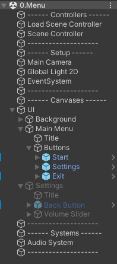
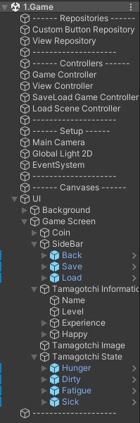

# Tamagotchi

<figure>
    
     
    <figcaption>Gameplay screenshot</figcaption>
</figure>

## 🚀 Introduction

The game is a classic Tamagotchi with clicker elements.

## 📚 Description

The player's goal is to monitor the virtual pet's state and maintain it by clicking to restore various indicators, such as Hunger, Dirty, Fatigue, and Sick, which are displayed at the bottom of the screen. Players can also earn coins by clicking on the pet's image. The pet's overall state is measured by the happiness indicator. During the game, the pet automatically gains experience points, leading to level-ups. The higher the pet's happiness level, the faster it gains experience. With each new level, the number of coins earned per click increases.

## 🎬 Gameplay

    <kbd>
        <video src="https://github.com/user-attachments/assets/f4204bbc-9ecf-4127-9b6c-be5f9eb332d4"></video>
    </kbd>

[Download link](https://github.com/AlekseyShashkov/Tamagotchi_DiplomTMS/raw/main/vid/gameplay.mp4)

## ✨ Features

    <table border="1">
        <tr align="center">
            <th><b>Scene 0.Menu</b></th>
            <th><b>Scene 1.Game</b></th>
        </tr>
        <tr>
            <td width="50%">
                Main menu, allowing the player to choose their next action:
                <h5>
                    
                    <ul>
                        <li>Start - starts a new game session. Clicking this button transitions the player to the game scene;</li>
                        <li>Settings - opens the settings window. Here, the user can adjust the volume of background music and sound effects using a slider for fine-tuning the audio experience;</li>
                        <li>Exit - closes the game. Clicking this button exits the game entirely.</li>
                    </ul>
                </h5>
            </td>
            <td width="50%">
                Gameplay area where players interact with their virtual pet:
                <h5>
                    
                    <ul>
                        <li>Manage pet's state - monitor and maintain the pet's various states, such as Hunger, Dirty, Fatigue, and Sick by clicking to restore them;</li>
                        <li>Interact and earn coins - click on the pet to interact and earn coins. The amount of coins earned per click increases with the pet’s level;</li>
                        <li>Save and Load - save your progress and resume the game from the last saved point.</li>
                    </ul>
                </h5>
            </td>
        </tr>
    </table>

## 🧱 Architecture

### 🧩 System structure

    <figure>
        
         
        <figcaption>UML Class diagram</figcaption>
    </figure>

>[!NOTE]
>Different directives are indicated using colors.

    <table border="1">
        <tr>
            <th><a href="Assets/_Project/_Scripts/Game">Game</a></th>
            <th><a href="Assets/_Project/_Scripts/Misc">Misc</a></th>
            <th><a href="Assets/_Project/_Scripts/View">View</a></th>
        </tr>
        <tr>
            <td valign="top" align="left">
                <table>
                    <tr>
                        <td><code> #00ced1</code></td>
                        <td><kbd><a href="Assets/_Project/_Scripts/Game">_Scripts/Game</a></kbd></td>
                    </tr>
                    <tr>
                        <td><code> #ffd700</code></td>
                        <td><kbd><a href="Assets/_Project/_Scripts/Game/Coin">_Scripts/Game/Coin</a></kbd></td>
                    </tr>
                    <tr>
                        <td><code> #5f9ea0</code></td>
                        <td><kbd><a href="Assets/_Project/_Scripts/Game/Tamagotchi">_Scripts/Game/Tamagotchi</a></kbd></td>
                    </tr>
                    <tr>
                        <td><code> #f6f6f4</code></td>
                        <td><kbd><a href="Assets/_Project/_Scripts/Game/Tamagotchi/State">_Scripts/Game/Tamagotchi/State</a></kbd></td>
                    </tr>
                    <tr>
                        <td><code> #9370db</code></td>
                        <td><kbd><a href="Assets/_Project/_Scripts/Game/Repository/View">_Scripts/Game/Repository/View</a></kbd></td>
                    </tr>
                    <tr>
                        <td><code> #d8bfd8</code></td>
                        <td><kbd><a href="Assets/_Project/_Scripts/Game/Repository/Button">_Scripts/Game/Repository/Button</a></kbd></td>
                    </tr>
                </table>
            </td>
            <td valign="top" align="left">
                <table>
                    <tr>
                        <td><code> #f0e68c</code></td>
                        <td><kbd><a href="Assets/_Project/_Scripts/Misc">_Scripts/Misc</a></kbd></td>
                    </tr>
                    <tr>
                        <td><code> #ff6f61</code></td>
                        <td><kbd><a href="Assets/_Project/_Scripts/Misc/SaveLoadSystem">_Scripts/Misc/SaveLoadSystem</a></kbd></td>
                    </tr>
                </table>
            </td>
            <td valign="top" align="left">
                <table>
                    <tr>
                        <td><code> #5f9fff</code></td>
                        <td><kbd><a href="Assets/_Project/_Scripts/View">_Scripts/View</a></kbd></td>
                    </tr>
                    <tr>
                        <td><code> #ffdab9</code></td>
                        <td><kbd><a href="Assets/_Project/_Scripts/View/Screen">_Scripts/View/Screen</a></kbd></td>
                    </tr>
                    <tr>
                        <td><code> #8fd5a6</code></td>
                        <td><kbd><a href="Assets/_Project/_Scripts/View/Button">_Scripts/View/Button</a></kbd></td>
                    </tr>
                </table>
            </td>
        </tr>
    </table>

### 🗃️ Project hierarchy

<table border="1">
    <tr>
        <th><b>Scene 0.Menu</b></th>
        <th><b>Scene 1.Game</b></th>
    </tr>
    <tr>
        <td valign="top"></td>
        <td valign="top"></td>
    </tr>
</table>

## ⚙️ Requirements

- `2021.3.41f1 or later`

## ⚖️ Licensed under the [MIT License](LICENSE)
